# Jarkom-Modul-3-IT09-2024

## Angggota

| Anggota | NRP  |
| ------- | --- |
| Michael Kenneth Salim | 5027231008 |
| Tio Axelino | 5027231065 |

## Topologi

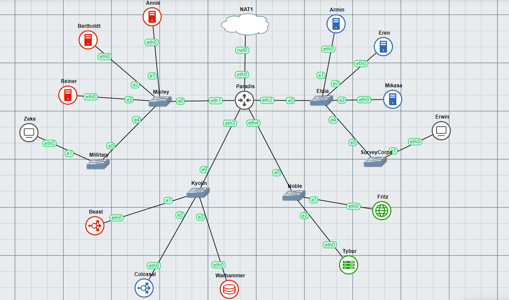

## Network Config

### Paradis (Router)
```sh
auto eth0
iface eth0 inet dhcp

auto eth1
iface eth1 inet static
	address 10.68.1.1
	netmask 255.255.255.0

auto eth2
iface eth2 inet static
	address 10.68.2.1
	netmask 255.255.255.0

auto eth3
iface eth3 inet static
	address 10.68.3.1
	netmask 255.255.255.0

auto eth4
iface eth4 inet static
	address 10.68.4.1
	netmask 255.255.255.0
```
### Fritz (DNS Server)
```sh
auto eth0
iface eth0 inet static
	address 10.68.4.2
	netmask 255.255.255.0
	gateway 10.68.4.1
```


### Tybur (DHCP Server)
```sh
auto eth0
iface eth0 inet static
	address 10.68.4.3
	netmask 255.255.255.0
	gateway 10.68.4.1
```

### Beast (Load Balancer - Laravel)
```sh
auto eth0
iface eth0 inet static
	address 10.68.3.2
	netmask 255.255.255.0
	gateway 10.68.3.1
```

### Colossal (Load Balancer - PHP)
```sh
auto eth0
iface eth0 inet static
	address 10.68.3.3
	netmask 255.255.255.0
	gateway 10.68.3.1
```

### Warhammer (Database Server)
```sh
auto eth0
iface eth0 inet static
	address 10.68.3.4
	netmask 255.255.255.0
	gateway 10.68.3.1
```

### Annie (Laravel Worker)
```sh
auto eth0
iface eth0 inet static
	address 10.68.1.2
	netmask 255.255.255.0
	gateway 10.68.1.1
```

### Bertholdt (Laravel Worker)
```sh
auto eth0
iface eth0 inet static
	address 10.68.1.3
	netmask 255.255.255.0
	gateway 10.68.1.1
```

### Reiner (Laravel Worker)
```sh
auto eth0
iface eth0 inet static
	address 10.68.1.4
	netmask 255.255.255.0
	gateway 10.68.1.1
```

### Armin (PHP Worker)
```sh
auto eth0
iface eth0 inet static
	address 10.68.2.2
	netmask 255.255.255.0
	gateway 10.68.2.1
```

### Eren (PHP Worker)
```sh
auto eth0
iface eth0 inet static
	address 10.68.2.3
	netmask 255.255.255.0
	gateway 10.68.2.1
```

### Mikasa (PHP Worker)
```sh
auto eth0
iface eth0 inet static
	address 10.68.2.4
	netmask 255.255.255.0
	gateway 10.68.2.1
```

### Zeke (Client - Dynamic)
```sh
auto eth0
iface eth0 inet dhcp
```

### Erwin (Client - Dynamic)
```sh
auto eth0
iface eth0 inet dhcp
```

---

## Soal Nomer 0
Pulau Paradis telah menjadi tempat yang damai selama 1000 tahun, namun kedamaian tersebut tidak bertahan selamanya. Perang antara kaum Marley dan Eldia telah mencapai puncak. Kaum Marley yang dipimpin oleh Zeke, me-register domain name marley.yyy.com untuk worker Laravel mengarah pada Annie. Namun ternyata tidak hanya kaum Marley saja yang berinisiasi, kaum Eldia ternyata sudah mendaftarkan domain name eldia.yyy.com untuk worker PHP (0) mengarah pada Armin.

## Setup DNS pada Fritz (DNS Server)

a. Instalasi dependencies yang diperlukan

```sh
apt-get update
apt-get install bind9 -y
```

b. Menjalankan service dari bind9

```sh
service bind9 start
```

c. Menambahkan line berikut pada file `etc/bind/named.conf.local`

```sh
zone "marley.it09.com" {
    type master;
    file "/etc/bind/it09/marley.it09.com";
};

zone "eldia.it09.com" {
    type master;
    file "/etc/bind/it09/eldia.it09.com";
};
```

d. Membuat DNS record pada `/etc/bind/it09/marley.it09.com`

```sh
$TTL    604800
@       IN      SOA     marley.it09.com. root.marley.it09.com. (
                        2				; Serial
                        604800			; Refresh
                        86400			; Retry
                        2419200         ; Expire
                        604800 )		; Negative Cache TTL
;
@       IN  NS      marley.it09.com.
@       IN  A       10.68.1.2
www     IN  CNAME   marley.it09.com.
```

e. Membuat DNS record pada `/etc/bind/it09/eldia.it09.com`

```sh
$TTL    604800
@       IN      SOA     eldia.it09.com. root.eldia.it09.com. (
                        2				; Serial
                        604800			; Refresh
                        86400			; Retry
                        2419200         ; Expire
                        604800 )		; Negative Cache TTL
;
@       IN  NS      eldia.it09.com.
@       IN  A       10.68.2.2
www     IN  CNAME   eldia.it09.com.
```

f. Masukkan ini ke dalam file `/etc/bind/named.conf.options` agar client bisa mengakses internet

```sh
options {
        directory "/var/cache/bind";

        forwarders {
            192.168.122.1;
        };

        allow-query{any;};

        auth-nxdomain no;
        listen-on-v6 { any; };
};
```

g. Merestart service dari bind9

```sh
service bind9 restart
```


## Soal Nomer 1
Lakukan konfigurasi sesuai dengan peta yang sudah diberikan. Semua Client harus menggunakan konfigurasi ip address dari keluarga Tybur (dhcp).

### Setup DHCP Server (Tybur)

a. Instalasi dependencies yang diperlukan

```sh
apt-get update
apt-get install isc-dhcp-server -y
```

b. Menjalankan service dari isc-dhcp-server

```sh
service isc-dhcp-server start
```

c. Menambahkan line berikut pada file `/etc/default/isc-dhcp-server`

```sh
INTERFACES="eth0"
```

d. Menambahkan line berikut pada file `/etc/dhcp/dhcpd.conf`

```sh
subnet 10.68.1.0 netmask 255.255.255.0 {
	option routers 10.68.1.1;
	option broadcast-address 10.68.1.255;
	option domain-name-servers 10.68.4.2;
}

subnet 10.68.2.0 netmask 255.255.255.0 {
	option routers 10.68.2.1;
	option broadcast-address 10.68.2.255;
	option domain-name-servers 10.68.4.2;
}

subnet 10.68.3.0 netmask 255.255.255.0 {}

subnet 10.68.4.0 netmask 255.255.255.0 {}
```

e. Merestart service dari isc-dhcp-server

```sh
service isc-dhcp-server restart
```

### Setup DHCP Relay (Paradis)

a. Instalasi dependencies yang diperlukan

```sh
apt-get update
apt-get install isc-dhcp-relay -y
```

b. Menjalankan service dari isc-dhcp-relay

```sh
service isc-dhcp-relay start
```

c. Menambahkan line berikut pada file `/etc/default/isc-dhcp-relay`

```sh
SERVERS="10.68.4.3"
INTERFACES="eth1 eth2 eth3 eth4"
OPTIONS=""
```

d. Menambahkan line berikut pada file `/etc/sysctl.conf`

```sh
net.ipv4.ip_forward=1
```

e. Merestart service dari isc-dhcp-relay

```sh
service isc-dhcp-relay restart
```

f. Menampilkan status dari isc-dhcp-relay

```sh
service isc-dhcp-relay status
```

## Soal Nomer 2 - 4
Client yang melalui bangsa marley mendapatkan range IP dari [prefix IP].1.05 - [prefix IP].1.25 dan [prefix IP].1.50 - [prefix IP].1.100 (2)
Client yang melalui bangsa eldia mendapatkan range IP dari [prefix IP].2.09 - [prefix IP].2.27 dan [prefix IP].2 .81 - [prefix IP].2.243 (3)
Client mendapatkan DNS dari keluarga Fritz dan dapat terhubung dengan internet melalui DNS tersebut (4)


a. Menambahkan line range berikut pada file `/etc/dhcp/dhcpd.conf`

```sh
subnet 10.68.1.0 netmask 255.255.255.0 {
    range 10.68.1.05 10.68.1.25;
    range 10.68.1.50 10.68.1.100;
	option routers 10.68.1.1;
	option broadcast-address 10.68.1.255;
	option domain-name-servers 10.68.4.2;
}

subnet 10.68.2.0 netmask 255.255.255.0 {
    range 10.68.2.09 10.68.2.27;
    range 10.68.2.81 10.68.2.243;
	option routers 10.68.2.1;
	option broadcast-address 10.68.2.255;
	option domain-name-servers 10.68.4.2;
}
```

### Testing

#### Ping Marley
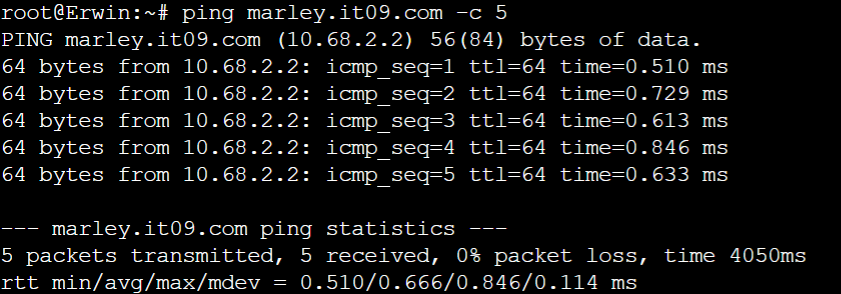

#### Ping Eldia
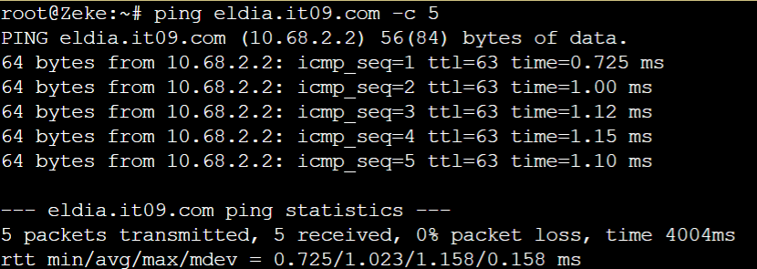

## Soal Nomer 5
Dikarenakan keluarga Tybur tidak menyukai kaum eldia, maka mereka hanya meminjamkan ip address ke kaum eldia selama 6 menit. Namun untuk kaum marley, keluarga Tybur meminjamkan ip address selama 30 menit. Waktu maksimal dialokasikan untuk peminjaman alamat IP selama 87 menit. (5)

a. Menambahkan line range berikut pada file `/etc/dhcp/dhcpd.conf`

```sh
subnet 10.68.1.0 netmask 255.255.255.0 {
    range 10.68.1.05 10.68.1.25;
    range 10.68.1.50 10.68.1.100;
	option routers 10.68.1.1;
	option broadcast-address 10.68.1.255;
	option domain-name-servers 10.68.4.2;
    default-lease-time 1800;
    max-lease-time 5220;
}

subnet 10.68.2.0 netmask 255.255.255.0 {
    range 10.68.2.09 10.68.2.27;
    range 10.68.2.81 10.68.2.243;
	option routers 10.68.2.1;
	option broadcast-address 10.68.2.255;
	option domain-name-servers 10.68.4.2;
    default-lease-time 360;
    max-lease-time 5220;
}
```

### Testing

#### Erwin
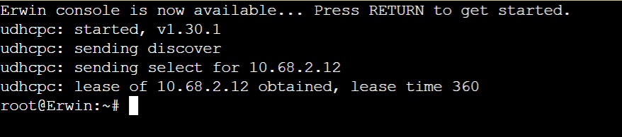
#### Zeke
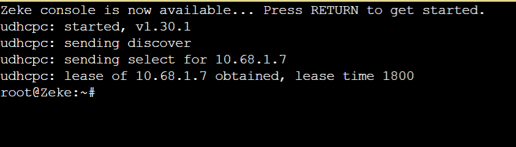

## Soal Nomer 6
Armin berinisiasi untuk memerintahkan setiap worker PHP untuk melakukan konfigurasi virtual host untuk website berikut https://intip.in/BangsaEldia dengan menggunakan php 7.3 (6)

### Setup PHP Worker (Armin, Eren, & Mikasa)

a. Instalasi dependencies yang diperlukan

```sh
apt-get update
apt-get install lynx nginx wget unzip php7.3 php-fpm -y
```

b. Menjalankan service dari php-fpm dan nginx

```sh
service php7.3-fpm start
service nginx start
```

c. Untuh file `eldia.zip` dan letakkan isinya pada directory `/var/www/html/`

```sh
mkdir -p /var/www/html/download/

wget --no-check-certificate 'https://drive.google.com/uc?export=download&id=1TvebIeMQjRjFURKVtA32lO9aL7U2msd6' -O /var/www/html/download/eldia.zip

unzip /var/www/html/download/eldia.zip -d /var/www/eldia.it09.com

rm -rf /var/www/html/download/
```

d. Menambahkan line berikut pada file `/etc/nginx/sites-available/eldia.it09.com`

```sh
server {
	listen 80;
	server_name eldia.it09.com;

	root /var/www/eldia.it09.com;

	index index.php index.html index.htm;

	server_name _;

	location / {
		try_files \$uri \$uri/ /index.php?\$query_string;
	}

	location ~ \.php$ {
		include snippets/fastcgi-php.conf;
		fastcgi_pass unix:/var/run/php/php7.3-fpm.sock;
	}

	error_log /var/log/nginx/jarkom-it09_error.log;
	access_log /var/log/nginx/jarkom-it09_access.log;
}
```

e. f. Buat symlink `eldia.it09.com` pada `/etc/nginx/sites-available/` di `/etc/nginx/sites-enabled`

```sh
ln -s /etc/nginx/sites-available/eldia.it09.com /etc/nginx/sites-enabled
```

f. Hapus `default` pada `/etc/nginx/sites-enabled/`

```sh
rm /etc/nginx/sites-enabled/default
```

g. Restart service nginx dan php-fpm

```sh
service php7.3-fpm start
service php7.3-fpm restart
service nginx restart
nginx -t
```

### Testing

#### Armin
```sh
lynx 10.68.2.2
```

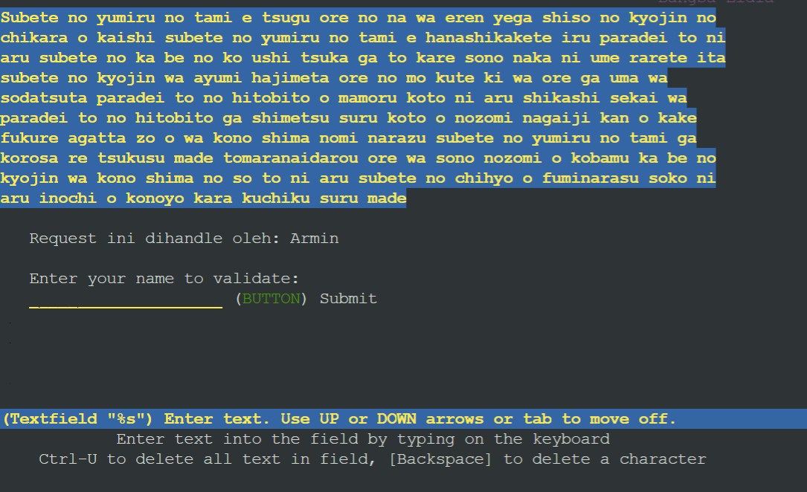

#### Eren
```sh
lynx 10.68.2.3
```

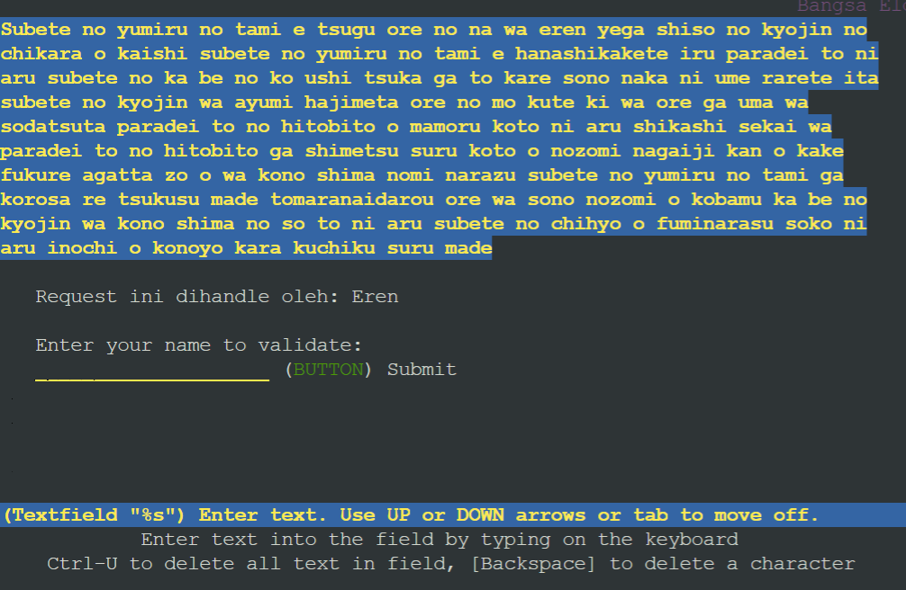

#### Mikasa
```sh
lynx 10.68.2.4
```
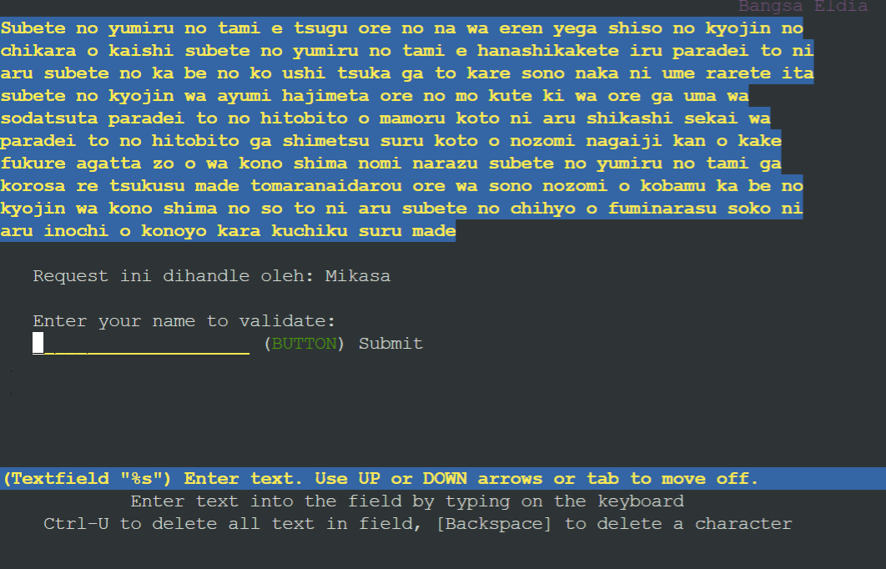

## Soal Nomer 7
Dikarenakan Armin sudah mendapatkan kekuatan titan colossal, maka bantulah kaum eldia menggunakan colossal agar dapat bekerja sama dengan baik. Kemudian lakukan testing dengan 6000 request dan 200 request/second. (7)

### Setup Load Balancer (Colossal)

a. Instalasi dependencies yang diperlukan

```sh
apt-get update
apt-get install lynx nginx php7.3 php-fpm apache2-utils -y
```

b. Menjalankan service dari php-fpm dan nginx

```sh
service php7.3-fpm start
service nginx start
```

c. Bersihkan isi dari folder `/etc/nginx/sites-available`

```sh
rm -rf /etc/nginx/sites-available/*
```

d. Menambahkan line berikut pada file `/etc/nginx/sites-available/load-balancer-it09`

```sh
upstream roundrobin {
    server 10.68.2.2;
    server 10.68.2.3;
    server 10.68.2.4;
}

server {
    listen 80;
    server_name _;

    root /var/www/html;

    index index.html index.htm index.nginx-debian.html;

    location / {
        proxy_pass http://roundrobin;
    }
}
```

e. Buat symlink `load-balancer-it09` pada `/etc/nginx/sites-available/` di `/etc/nginx/sites-enabled`

```sh
ln -s /etc/nginx/sites-available/load-balancer-it09 /etc/nginx/sites-enabled
```

f. Restart service nginx dan php-fpm

```sh
service nginx restart
service php7.3-fpm restart
```

### Testing

```sh
ab  -n 6000 -c 200 http://10.68.3.3/
```

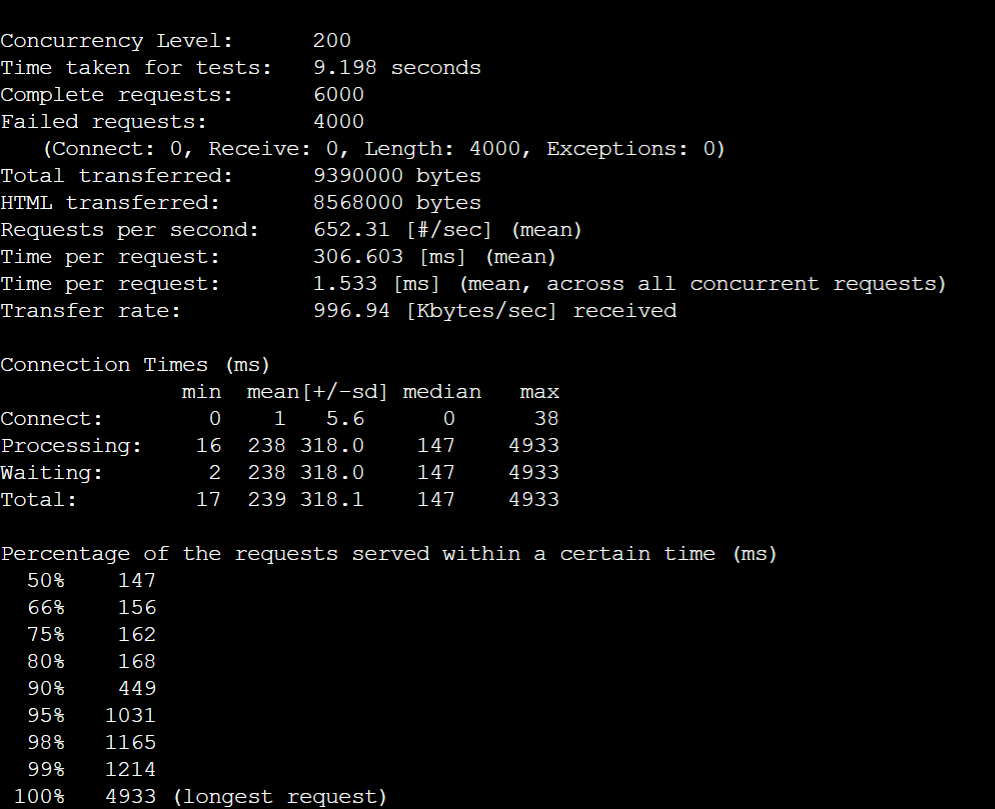

## Soal Nomer 8
Karena Erwin meminta “laporan kerja Armin”, maka dari itu buatlah analisis hasil testing dengan 1000 request dan 75 request/second untuk masing-masing algoritma Load Balancer dengan ketentuan sebagai berikut:
- Nama Algoritma Load Balancer
- Report hasil testing pada Apache Benchmark
- Grafik request per second untuk masing masing algoritma
- Analisis (8)

a. Gunakan Script dibawah untuk menjalankan load balancer

```sh
ab  -n 1000 -c 75 http://10.68.3.3/<endpoint>
```

b. Untuk mengganti menjadi algoritma lain, tambahkan endpoint pada akhir script di atas

```sh
upstream roundrobin {
    server 10.68.2.2;
    server 10.68.2.3;
    server 10.68.2.4;
}

upstream leastconnect {
    least_conn;
    server 10.68.2.2;
    server 10.68.2.3;
    server 10.68.2.4;
}

upstream iphash {
    ip_hash;
    server 10.68.2.2;
    server 10.68.2.3;
    server 10.68.2.4;
}

upstream genhash {
    hash $remote_addr consistent;
    server 10.68.2.2;
    server 10.68.2.3;
    server 10.68.2.4;
}

server {
    listen 80;
    server_name _;

    root /var/www/html;

    index index.html index.htm index.nginx-debian.html;

    location /roundrobin {
        proxy_pass http://roundrobin;
    }

	location /leastconnect {
        proxy_pass http://leastconn3;
    }

    location /iphash {
        proxy_pass http://iphash;
    }

    location /genhash {
        proxy_pass http://genhash;
    }
}
```
## Testing

### Round Robin
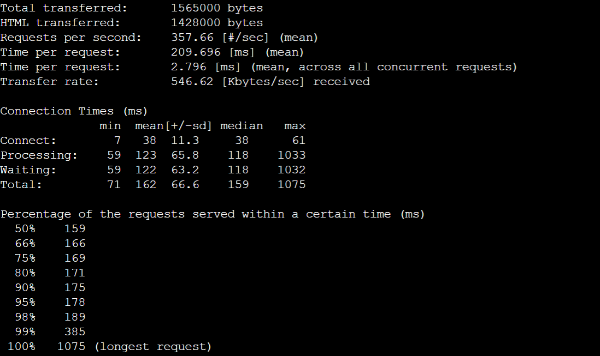

### Least Connection
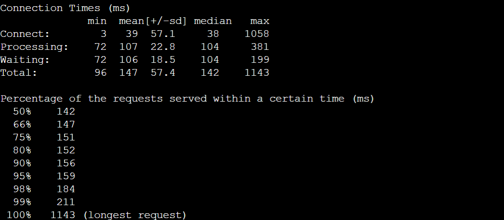

### Ip hash
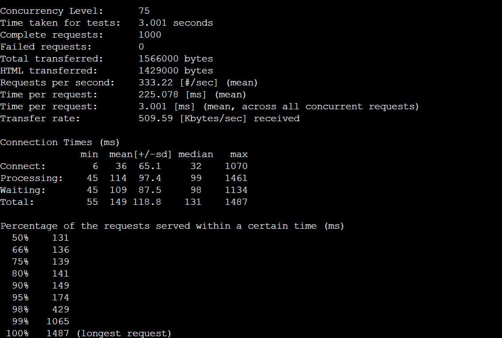

### Gen Hash
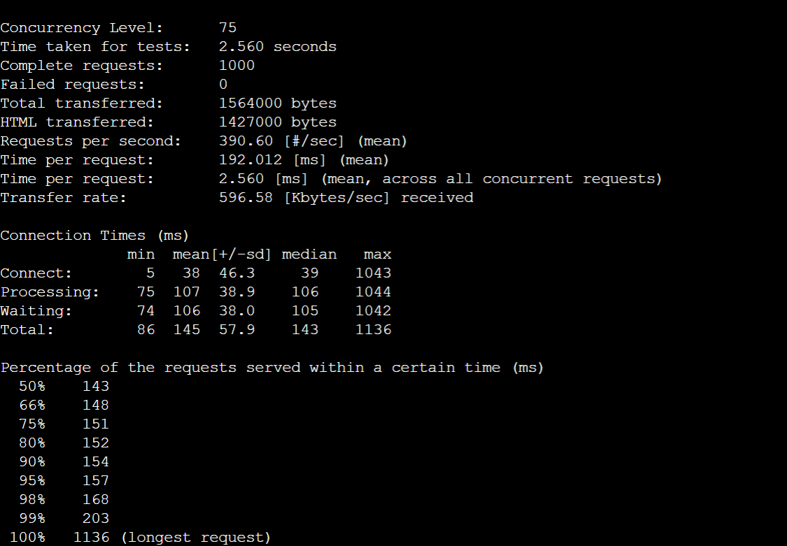

### Grafik

## Soal Nomer 9
Dengan menggunakan algoritma Least-Connection, lakukan testing dengan menggunakan 3 worker, 2 worker, dan 1 worker sebanyak 1000 request dengan 10 request/second, kemudian tambahkan grafiknya pada “laporan kerja Armin”. (9)

a. Gunakan Script dibawah untuk menjalankan load balancer

```sh
ab  -n 1000 -c 10 http://10.68.3.3/
```

b. Ubah script pada file `/etc/nginx/sites-available/load-balancer-it09`, lalu hapus server nya dari 3 worker menjadi 2 worker lalu terakhir 1 worker

```sh
upstream leastconnect {
    least_conn;
    server 10.68.2.2;
    server 10.68.2.3;
    server 10.68.2.4;
}

server {
    listen 80;
    server_name _;

    root /var/www/html;

    index index.html index.htm index.nginx-debian.html;

    location / {
        proxy_pass http://leastconnect;
    }
}
```

## Testing

### Hasil 3 Worker

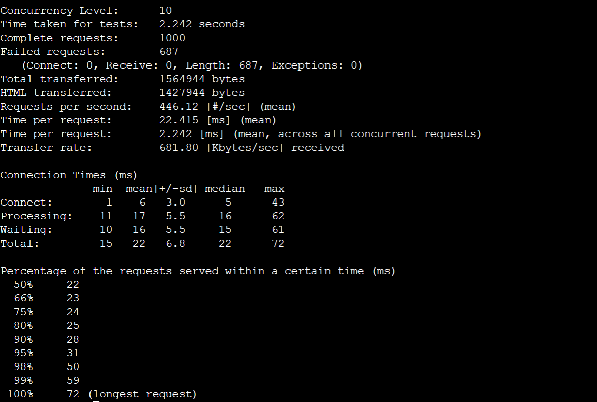

### Hasil 2 Worker

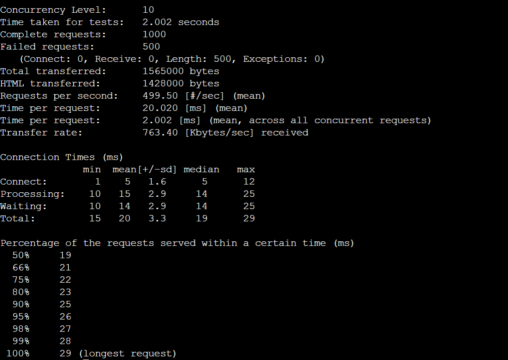

### Hasil 1 Worker

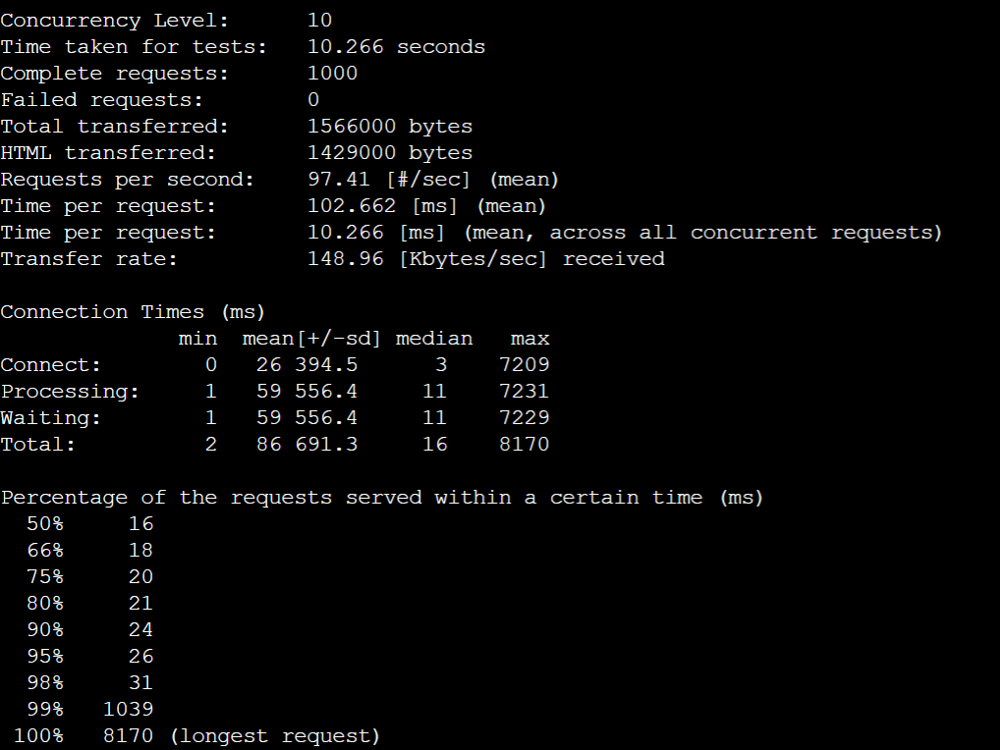

## Soal Nomer 10
Selanjutnya coba tambahkan keamanan dengan konfigurasi autentikasi di Colossal dengan dengan kombinasi username: “arminannie” dan password: “jrkmyyy”, dengan yyy merupakan kode kelompok. Terakhir simpan file “htpasswd” nya di /etc/nginx/supersecret/ (10)

### Setup Load Balancer (Colossal)

a. Instalasi dependencies yang diperlukan

```sh
apt-get update
apt-get install apache2-utils -y
```

b. Membuat folder supersecret

```sh
mkdir -p /etc/nginx/supersecret
```

c. Buat file `htpasswd` dengan username dan password yang telah ditentukan

```sh
htpasswd -cb /etc/nginx/supersecret/htpasswd arminannie jrkmit09
```

d. Menjalankan service dari php-fpm dan nginx

```sh
service php7.3-fpm start
service nginx start
```

e. Edit konfigurasi `server` pada file `/etc/nginx/sites-available/load-balancer-it09.conf` menjadi seperti berikut

```sh
server {
	listen 80;

	root /var/www/html;

	index index.html index.htm index.nginx-debian.html;

	server_name _;

	location / {
		auth_basic "Restricted Content";
        auth_basic_user_file /etc/nginx/supersecret/htpasswd;
        proxy_pass http://leastconnect;
	}
}
```

## Testing

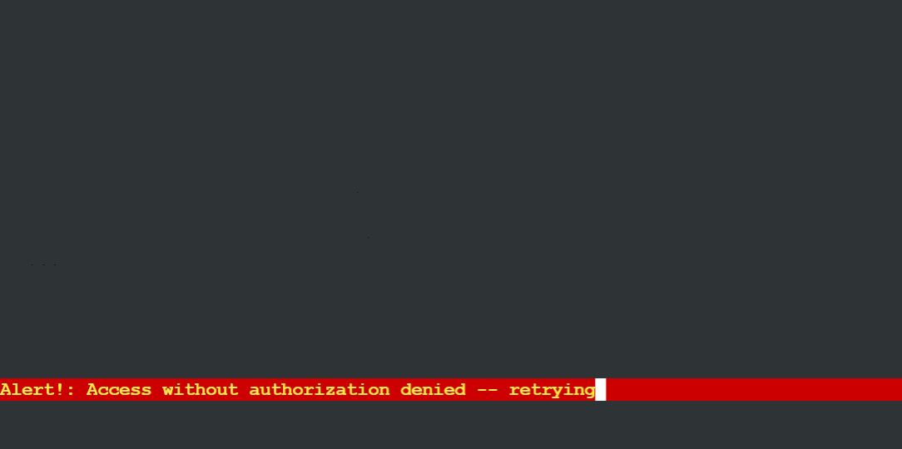

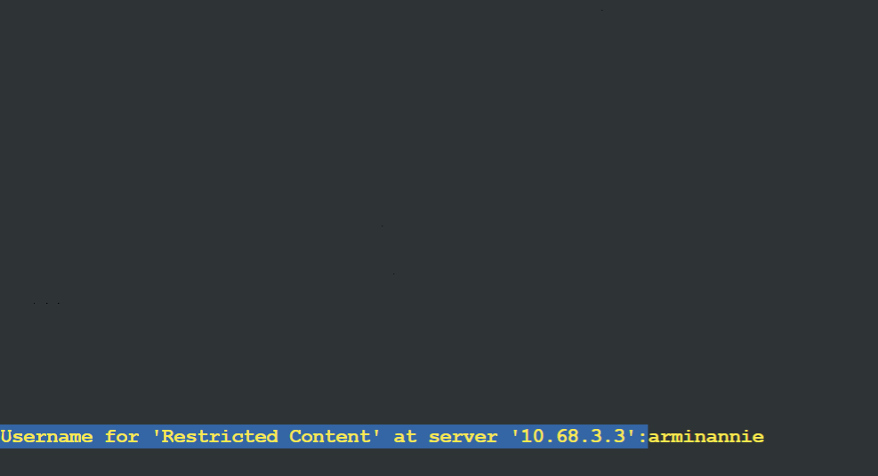

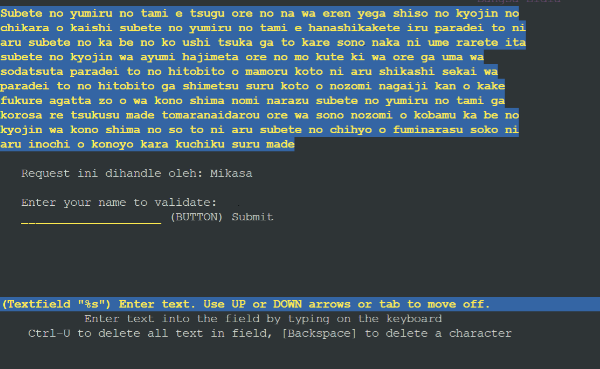

## Soal Nomer 11
Lalu buat untuk setiap request yang mengandung /titan akan di proxy passing menuju halaman https://attackontitan.fandom.com/wiki/Attack_on_Titan_Wiki (11) 
hint: (proxy_pass)

### Setup Load Balancer (Colossal)

a. Edit konfigurasi `server` pada file `/etc/nginx/sites-available/load-balancer-it09.conf` lalu tambahkan line berikut

```sh
    location /titan {
		proxy_pass https://attackontitan.fandom.com/wiki/Attack_on_Titan_Wiki/;
    }
```

b. Restart service nginx dan php-fpm

```sh
service nginx restart
service php7.3-fpm restart
```

## Testing

```sh
lynx 10.68.3.3/titan
```

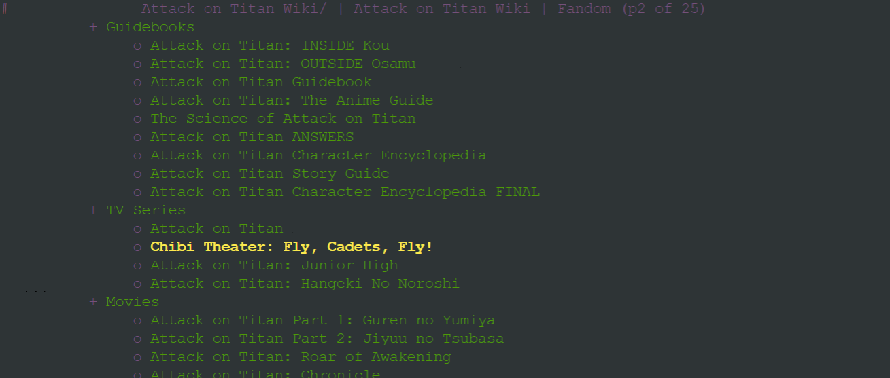

## Soal Nomer 12
Selanjutnya Colossal ini hanya boleh diakses oleh client dengan IP [Prefix IP].1.77, [Prefix IP].1.88, [Prefix IP].2.144, dan [Prefix IP].2.156. (12) 
hint: (fixed in dulu clientnya)

a. Edit konfigurasi `server` pada file `/etc/nginx/sites-available/load-balancer-it09.conf` tambahkan line berikut

```sh
    location / {
        allow 10.68.1.77;
		allow 10.68.1.88;
		allow 10.68.2.144;
		allow 10.68.2.156;
        deny all;
        proxy_pass http://leastconnect;
    }
```

b. Restart service nginx dan php-fpm

```sh
service nginx restart
service php7.3-fpm restart
```

## Testing

```sh
lynx 10.68.3.3
```

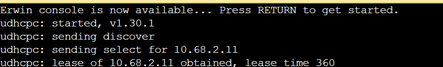

### Hasil 
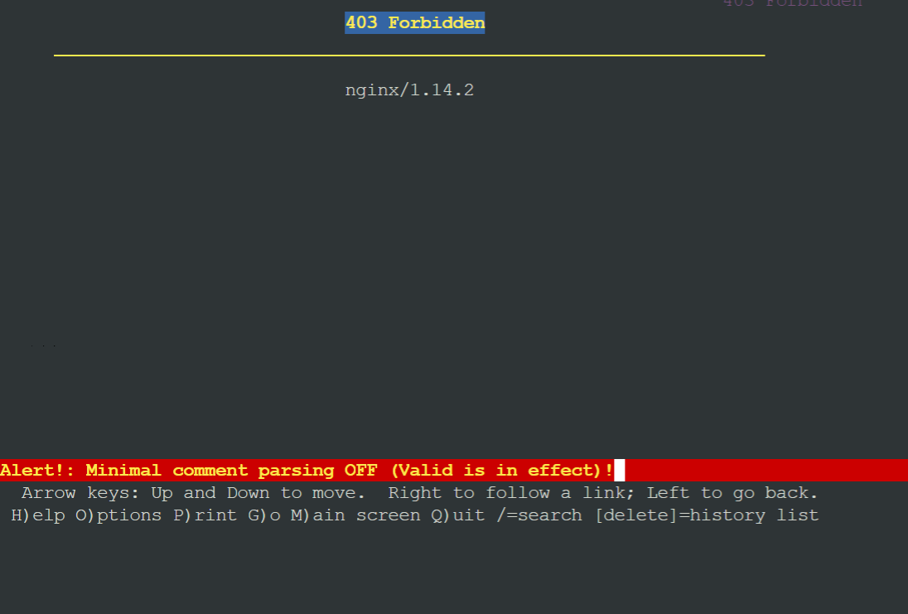

```sh
    location / {
        allow 10.68.1.77;
		allow 10.68.1.88;
		allow 10.68.2.144;
		allow 10.68.2.156;
		allow 10.68.2.11;
        deny all;
        proxy_pass http://roundrobin;
    }
```

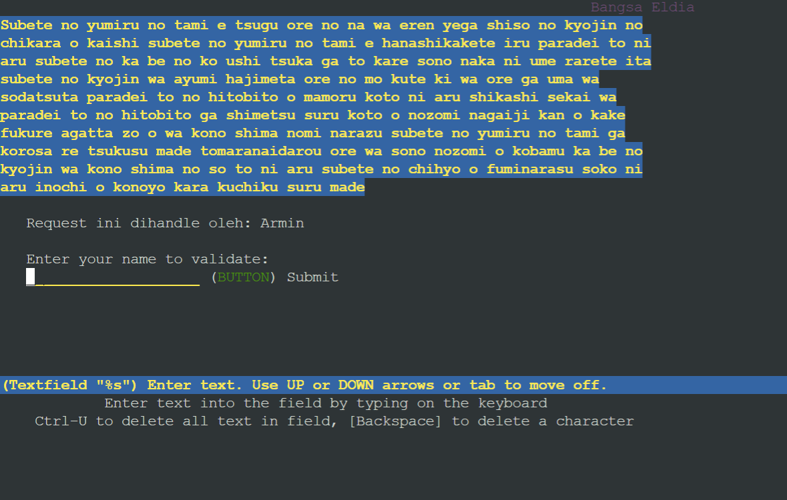

## Soal Nomer 13
Karena mengetahui bahwa ada keturunan marley yang mewarisi kekuatan titan, Zeke pun berinisiatif untuk menyimpan data data penting di Warhammer, dan semua data tersebut harus dapat diakses oleh anak buah kesayangannya, Annie, Reiner, dan Berthold. (13)

### Setup Database Server (WarHammer)

a. Instalasi dependencies yang diperlukan

```sh
apt-get update
apt-get install mariadb-server -y
```

b. Memulai service dari mysql

```sh
service mysql start
```

c. Membuat konfigurasi `mysql` sebagai berikut

```sh
CREATE USER 'kelompokit09'@'%' IDENTIFIED BY 'passwordit09';
CREATE USER 'kelompokit09'@'localhost' IDENTIFIED BY 'passwordit09';
CREATE DATABASE dbkelompokit09;
GRANT ALL PRIVILEGES ON *.* TO 'kelompokit09'@'%';
GRANT ALL PRIVILEGES ON *.* TO 'kelompokit09'@'localhost';
FLUSH PRIVILEGES;

```

d. Akses ke database mysql dengan username `kelompokit09` dan `passwordit09` lalu tampilkan semua database dengan command

```sh
SHOW DATABASES;
```

e. Tambahkan line berikut pada file `/etc/mysql/my.cnf`

```sh
[mysqld]
skip-networking=0
skip-bind-address
```

f. Restart service dari mysql

```sh
service mysql restart
```

### Setup Laravel Worker (Annie, Bertholdt, & Reiner)

a. Instalasi dependencies yang diperlukan

```sh
apt-get update
apt-get install mariadb-server -y
```

### Testing

```sh
mariadb --host=10.68.3.4 --port=3306 --user=kelompokit09 --password
```

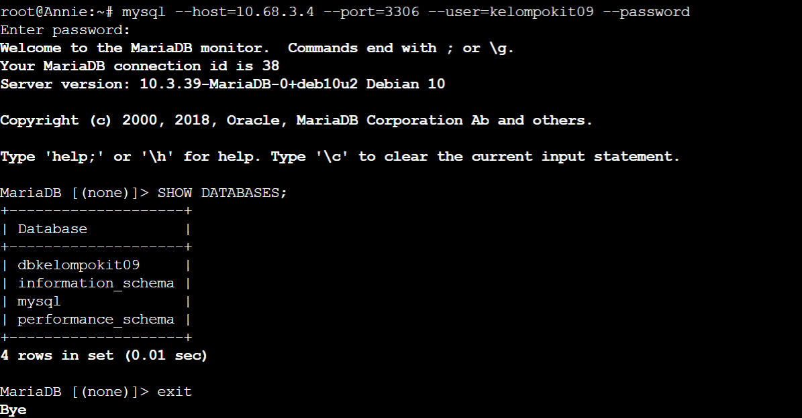